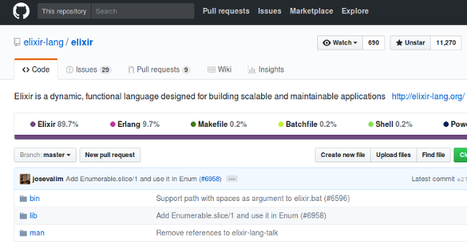
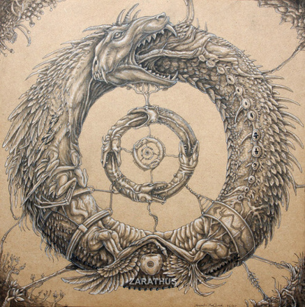
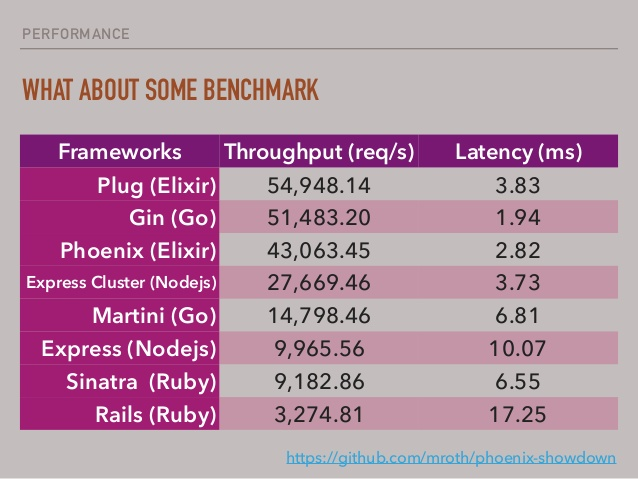

---
## Функционално програмиране с Elixir

---


---
### Кои сме ние?

* Ние ползваме Elixir в свободното си време. |
* Ние ползваме професионално Elixir. |
* Това е третата година на курса. |
* Създаваме материали и код свързани с курса.   |

---


---


---
### Кои сте вие?

* Искате да разберете защо напоследък се говори за Erlang/Elixir (в определени среди)?             |
* Фенове сте на Elixir/Erlang и искате да учите Elixir? |
* Искате да изкарате курс от типа 'Програмиране с |език|', за да си обогатите познанията? |

---
### Кои сте вие?

* Искате да запишете курс от типа 'Програмиране с |език|' за лесни кредити?
* Като чуето 'Функционално програмиране' си представяте типови системи и монади??? |

---
### Защо да учим нов език?!

* Нали си знам PHP | JAVA | C# | Ruby | Python | Това-с-което-(ще-)си-вадя-хляба? |
* Тези хипстъри, дето всяка година учат нов език, за нищо не стават!  |
* Всяка година, не, всяка седмица нова 'технология', то не може всичко я! |

---


---
### Защо да учим Elixir?

* Всички твърдения от предния слайд са вярни. Не всичко работи за всички. |
* Няма сребърен куршум, но за всичко си има набор от добри инструменти. |
* Дайте шанс и време на този набор от инструменти? |

---
### Какво е Elixir?

* Elixir е език, който върви на BEAM. |
* BEAM e виртуалната машина на Erlang.  |
* Ахаа! Значи нещо като Scala, както се отнася към Java?  |
* И да, и не.  |
* Elixir е Erlang. Но и нещо повече. |

---
### Какво е Erlang?


---
Erlang е създаден с цел: писане на телеком програми

* Конкурентни (едно устройство трябва да може да поддържа хиляди едновременни транзакции). |
* Толерантни към грешки и проблеми - както софтуерни, така и хардуерни.  |
* Практически нулев downtime.  |
* Кодът им трябва да може да се заменя с по-нови версии, докато те работят.  |

---
#### А какви проблеми имаме днес?
 |

---


---


---


---
Joe Armstrong (създател на Erlang) нарича Erlang "език за конкурентно-ориентирано програмиране", като се базира на няколко правила:

---
### Erlang!
1. Кодът върви в процеси, които са на ниво език.
2. Тези процеси не споделят памет - имат собствен стек и собствен heap.
3. Много са евтини за създаване и си комуникират чрез размяна на съобщения.
4. Лесно могат да си комуникират помежду си, дори да са на различни машини.
5. Ако един процес 'умре', другите продължават да живеят. Може нов да го замести, зависи от стратегията.

---
### Erlang върви на BEAM

* BEAM е способна да използва всички ядра на процесора без проблем. |
* BEAM-level процесите са много малки 1KB-2KB при създаването си. |
* Можем да създаваме огромен брой процеси без да се притесняваме. Говорим за милиони.  |
* Scheduler-ите на BEAM използват стратегия, различна от стратегиите в други езици - превантивна стратегия.  |

---
### Let it CRASH!!!


---
### Кой ползва Erlang?

---
* Amazon - за базата данни SimpleDB
* Yahoo! - за URL bookmarking  |
* WhatsApp - написана на Erlang, real-time съобщения, купена от Facebook  |

---
* T-Mobile, Motorola, Ericsson - за SMS услуги и 3G/4G мрежи. Ericsson са създатели на Erlang.
* RabbitMQ - AMQP имплементация  |
* CouchDB - популярна база данни  |
* Riak - data store  |

---
### Та какво е Elixir??

* Elixir наследява всички специфики и идеологии на Erlang. Все пак върви на BEAM. |
* Elixir може да използва всичко писано на Erlang. |
* Elixir идва с много добър инструментариум. |
* Elixir има много добро и бързо-растящо общество. |
* Elixir е модерен език, добър за web и IoT. |
* Споменахме ли, че е функционален език? |

---


---
### Началото

* Езикът се ползва някъде от 2013 (2011 първи копки) година, което го прави доста млад. |
* Създателят на Elixir, Жозе Валим (José Valim), идва от ruby/rails света. |
* Бързо набира популярност сред рубистите и ерлангаджиите. |

---


---
### Защо да учим Elixir?
* Защото можем да си напишем сървис, който ще поддържа хиляди потребителя online и ще живее в един OS процес.
* Защото имаме качествен инструментариум! |

---
### Инструментариум

* Elixir идва с mix. |
* Mix изпънява различни задачи - да речем прави нов Elixir проект. |
* Много лесно е да си напишем и своя задачка. |

---
### MIX


---
### Инструментариум

* Всъщност с mix можем да си направим собствена библиотека. |
* И да я качим в hex, откъдето можем да сваляме библиотеки на други хора. |
* Също така mix се справя страхотно с dependencies. |
* Има вградена добра библиотека за тестване. |
* Има лесен начин за генериране на HTML документация с връзки към кода. |
* Идва с инструмент за автоматично форматиране на кода. |

---
### NOT MIX


---
### Защо да учим Elixir?
* Защото можем да си напишем сървис, който ще поддържа хиляди потребителя online и ще живее в един OS процес.
* Защото имаме качествен инструментариум!
* Защото езикът е доста приятен и лесен за продуктивна работа!! |

---
### Продуктивност


---
### Езикът Elixir в няколко изречения:

* Модули, които са колекции от функции.
* Всичко е immutable.
* Кодът е изграден от композирани функции.
* Всичко върви в BEAM-процес.
* Кодът в тези BEAM-процеси е последователен, процесите вървят конкурентно един на друг.


---
#### Модули, колекции от функции:

```elixir
defmodule MyModule do
  import OtherModule

  def public_function(x) do
    x * private_function(x)
  end

  defp private_function(x) do
    x + other_module_public_function(x)
  end
end
```

---
#### Кодът е изграден от композирани функции:

```elixir
[1, 2, 3, 4, 5]
|> Enum.map(fn n -> n * n end)
|> Enum.filter(fn n -> n > 10 end)
|> Enum.reduce(1, &(&1 + &2))

# -> 42
```

---
#### Кодът е изграден от композирани функции:

```elixir
File.stream!("path/to/some/file")
|> Stream.flat_map(&String.split(&1, " "))
|> Enum.reduce(%{}, fn word, acc ->
  Map.update(acc, word, 1, & &1 + 1)
end)
|> Enum.to_list()
```

---
#### Pipes


---
#### Функционален език:
```elixir
4 = 4                 # Интерпретира се без грешка
5 = 4                 # Грешка - MatchError
a = 4                 # Няма грешка, 'a' има стойност 4
4 = a                 # Също няма грешка
{d, e, 5} = {7, 6, 5} # d става 7, e става 6

f = fn (x) -> x * x end
f.(3)
# -> 9
```

---
#### Функционален език:
```elixir
f = fn
  (5) -> {:ok, 5}
  (x) -> {:error, x}
end
{:ok, x} = f.(5)     # Успех, x получава стойност 5
{:ok, x} = f.(6)     # Грешка, резултатът е {:error, 6}

Map.put(%{a: 3}, :b, 4)
# %{a: 3, b: 4} -> Нов map
```

---
#### Процеси:
Процесите в Elixir/Erlang се създават със `spawn`.

```elixir
# Тази функция ще се изпълни в нов процес:
pid = spawn fn -> 2 * 21 end

Process.alive?(pid)
# false, тъй като функцията се изпълнява бързо.

# Можем да ползваме pid-а на текущия процес с:
self()
Process.alive?(self()) # true
```

---
#### Процеси:

```elixir
pid = spawn(fn ->
  receive do
    {:howdy, message} -> IO.puts(message)
    {_, message} -> IO.puts("Няма значение")
  end
end)

send pid, {:howdy, "Как си?"}
```

---
Parallel map(collection):

```elixir
defmodule PEnum do
  def pmap(collection, mapper) do
    collection
    |> Enum.map(&(Task.async(fn -> mapper.(&1) end)))
    |> Enum.map(&Task.await/1)
  end
end
```

---
No shared state, threads and locks.


---
### Защо Elixir?
* Защото можем да си напишем сървис, който ще поддържа хиляди потребителя online и ще живее в един OS процес.
* Защото имаме качествен инструментариум!
* Защото езикът е доста приятен и лесен за продуктивна работа!!
* Защото с Elixir сме МЕТА! |

---
### Metaprogramming


---
### Metaprogramming

* Всъщност defmodule е макро.
* Както и def за функция.
* Както и почти всичко, което ще ползвате.

---
### Metaprogramming

##### Elixir е написан на Elixir



---
### Metaprogramming

##### Позволява ни да правим такива неща
```elixir
from Post,
  where: [category: "fresh and new"],
  order_by: [desc: :published_at],
  select: [:id, :title, :body]
```

---
### Metaprogramming

##### Това пък е резултат от неуспешен тест


---
### Защо Elixir?
* Защото можем да си напишем сървис, който ще поддържа хиляди потребителя online и ще живее в един OS процес.
* Защото имаме качествен инструментариум!
* Защото езикът е доста приятен и лесен за продуктивна работа!!
* Защото с Elixir сме МЕТА!
* Защото обществото около Elixir ще ви приветства! |

---
#### Обществото
* Elixir обществото раздвижи Erlang обществото.
* Erlang се развива, Elixir програмисти правят PR-и, помагат.
* Имаме и ще имаме множество чудесни библиотеки.

---
### В Elixir/Erlang има бъдеще



---
### Защо да учим Elixir?
* Защото можем да си напишем сървис, който ще поддържа хиляди потребителя online и ще живее в един OS процес.
* Защото имаме качествен инструментариум!
* Защото езикът е доста приятен и лесен за продуктивна работа!!
* Защото с Elixir сме МЕТА!
* Защото обществото около Elixir ще ви приветства!
* И всички тези mixture-и! |

---
#### Plug & Phoenix



---
#### Ecto


---
#### И още и още


---
#### Ще си говорим и за доста advanced неща!


---
### Кой ползва Elixir?

---
* Adobe - За колаборативна работа над фотографски материали.
* Discord - За voice/text чат за геймъри.
* Pinterest - Социална мрежа, написана на Elixir. За споделяне и тагване на хоби идеи по снимки.

---
* Pivotal - RabbitMQ CLI е написан на Elixir.
* Slack - Сървърите, поддържащи видео разговорите, са на Elixir.
* http://elixir-companies.com - Списък с компании, ползващи Elixir.

---
### Защо да научим Elixir?
* Защото е модерен, конкурентен език.
* Защото хората зад и около него са опитни.
* Защото основата му, Erlang, е стабилна и доказана.
* Защото е функционален език.
* Защото е подходящ за писане и поддръжка на много типове приложения.
* Защото ще разшири кръгозора ви.
* Защото е почти завършен.
* Защо не?

---
## Малко информация за курса


---
## Добре дошли!
* Ако сте записали курса за да вземете някоя изборна, ОТПИШЕТЕ ГО, няма да ви е лесно. |
* Ако смятате, че Обектно-ориентираното програмиране е единственият начин, този курс не е за вас. |
* Ако нямате достатъчно време, което да отделяте също ще ви е трудно. |
* Ако очаквате монади, комонади, апликативи, мощтни типови системи - не ги очаквайте. |

---
## Философия на курс

There will be no foolish wand waving or silly incantations in this class. As such, I don't expect many of you to enjoy the subtle science and exact art that is potion making. However, for those select few, who possess the predisposition, I can teach you how to bewitch the mind and ensnare the senses. I can tell you how to bottle fame, brew glory and even put a stopper in death.

---
## Какво ще трябва да научите в курса
* Elixir |
* да мислите и моделирате чрез функции, а не обекти |
* да съпоставяте образци |
* да изпозвате git |
* да сте истински шамани и алхимици способни да миксират всякакви отвари  |

---
## Организация на курса
* Курсът ще се провежда всеки X и Y от A&#58;B до C&#58;D.  |
* Ще се стараем за всяка тема да имаме подробна публикация в блога ни. |
* обикновено на лекция ще имаме презентация, но винаги сме готови да обсъдим нещо, което не е включено в нея. |

---
## Организация на курса
* Лекциите ще бъдат разделени в 3 основни блока |
  * Първият блок ще бъде информация за самия език и неговите идиоми |
  * Във втория ще говорим за паралелизъм и кокурентност |
  * В края на семестъра ще говорим за различни библиотеки и за неща котио смятаме за интересни |
  * Доста често ще говорим за Erlang |

---
## Оценяване
TODO - Слави/Отбор


---
## Оценяване
TODO - Слави/Отбор

---
## Скала за оценяване
TODO - Слави/Отбор
Оценнка|2|3|4|5|6|
-|-|-|-|-|-
Точки|0-64|65-74|75-94|95-114|115-135

---
## Ресурси
* Имаме сайт http://elixir-lang.bg
* Имаме Facebook група https://www.facebook.com/groups/636900123169076/
* Имаме mail [course@elixir-lang.bg](mailto:course@elixir-lang.bg)
* Github https://github.com/ElixirCourse
* Discord https://discord.gg/EZx7y67


---
## Край

